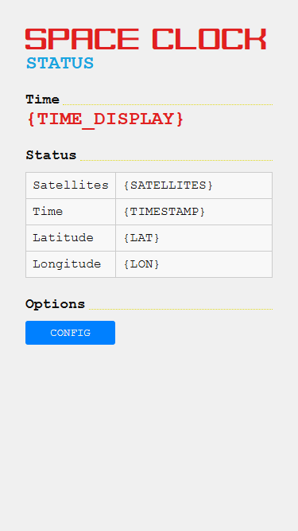
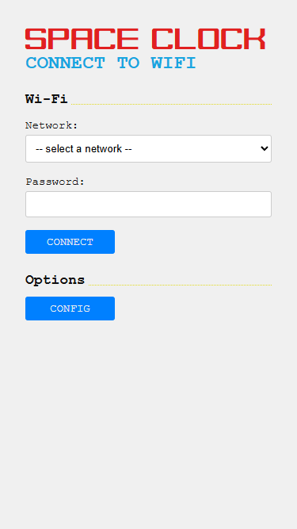
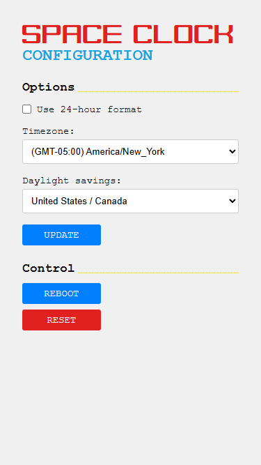
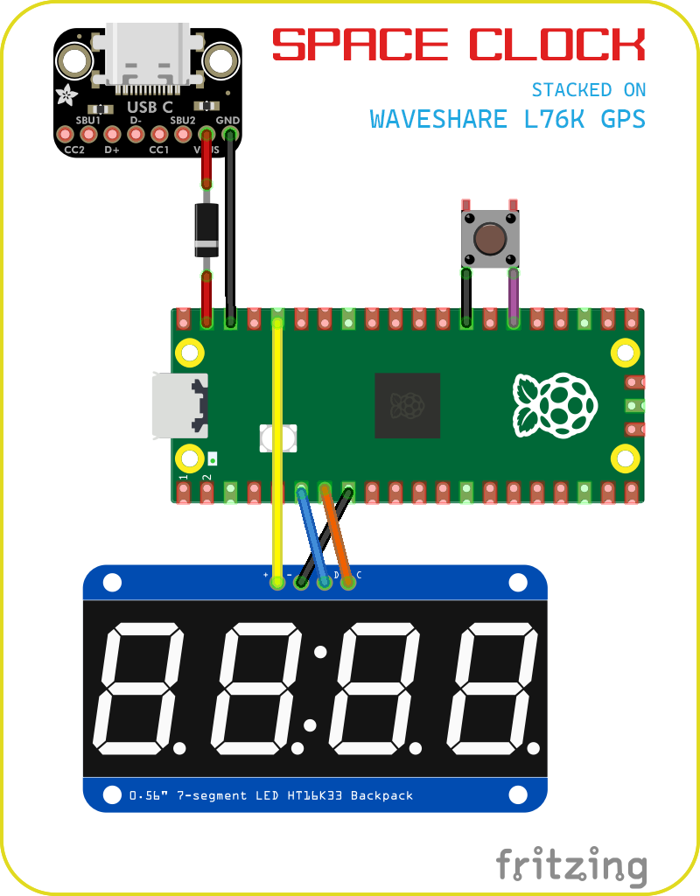

INTRODUCING THE

# SPACE CLOCK

ALWAYS RIGHT. AUTOMAGICALLY.

## What is the SPACE CLOCK ?

The SPACE CLOCK sets itself using GPS signals to achieve microsecond accuracy of up to one millionth of a second. Not only is the SPACE CLOCK a physical clock, but it also acts as an __NTP__ server (network time server) allowing you to sync precise time across all of your network devices.

## Features

- Captures `PPS (Pulse Per Second)` signal from `GPS satellites` which marks the exact start of a second
- Parses `GPS NEMA` sentences which contain data including `UTC Time`, Latitude / Longitude and more
- Built-in `NTP Server` for syncing network time
- `Web interface` with status page and configuration options __(24-hour Format, Timezone, Daylight Savings)__
- WiFi AP mode broadcasts a `hotspot` with web interface to `connect to nearby WiFi` networks
- Open-source firmware, schematics, and space-age 3D printable case

### Bill of Materials

- [Raspberry Pi Pico 2 W](https://www.raspberrypi.com/products/raspberry-pi-pico-2/)
- [Waveshare L76K GPS module](https://www.waveshare.com/pico-gps-l76k.htm)
- [4-Digit 7-Segment display](https://www.amazon.com//dp/B0BFQNFX6D/)
- [USB-C breakout board](https://www.amazon.com/dp/B0BLSN5PR8/)
- [Solderable breadboard mini](https://www.amazon.com/dp/B09WZY8CFV/)
- [Tactile button 6x6x5mm](https://www.amazon.com/dp/B01CGMP9GY/)
- [Schottky diode 1N5817](https://www.amazon.com/dp/B07Q5H1SLY/)
- [Female headers](https://www.amazon.com/dp/B0GM834DC8/)
- [M2x4mm screws](https://www.amazon.com/dp/B0DCKDF1PD/)
- [M3x4mm screws](https://www.amazon.com/dp/B08H24W42K/)

#### Optional for GPS

- [GPS antenna](https://www.amazon.com/dp/B07Y6D76G9/) for housing internally
- [ML1220 li-ion battery](https://www.amazon.com/dp/B088KT9HB9/) for preserving ephemeris information and hot starts

## Modes

The SPACE CLOCK can operate in modes with or without a WiFi connection.

### No WiFi

First boot and when no WiFi credentials are present will simply show the current time.

1. Power via USB-C, will display `----`
2. GPS to process UTC time, will display `rising / falling animation`

> To connect to WiFI hold the bottom button for 3 seconds to reboot into AP Mode

### WiFi Mode

If WiFi credentials are available it will attempt to connect, start web/ntp servers and then display the current time.

> If WiFi fails to connect the device will reboot

1. Power via USB-C, will display `----`
2. Connect to saved wifi, will display `wave animation`
3. Successful WiFi connection will display `IP address` once
4. Start servers for web interface and ntp
5. GPS to process UTC time, will display `rising / falling animation`

> You can view the [status page](http://{IP_ADDRESS}/status) when connected via _WiFi Mode_

### AP Mode

1. Power via USB-C, will display `----`
2. Scan for nearby networks, will display `SCAN`
3. Start the AP hotspot, will display the hotspot name and start the web server
4. __You connect to the hotspot__ (`space_clock`)
5. __You navigate to the default gateway__ (http://192.168.4.1)
6. A webpage will load showing nearby WiFi networks
7. __You select a WiFi network and enter its password__
8. Device will reboot into _WiFi Mode_

> You can view the [connect to wifi page](http://192.168.4.1/connect) when connected via _AP Mode_

## Configuration

The SPACE CLOCK operates on UTC Time and uses the following localized defaults which can be changed:

- __24-hour format__: False
- __Timezone__: (GMT-05:00) America/New_York
- __Daylight Savings__: US/CA

> You can change these settings through the [configuration page](http://192.168.4.1/config) when connected via _WiFi Mode_ or _AP Mode_

### 24-hour format

The SPACE CLOCK supports displaying localized time in either __12-hour AM/PM format__ or __24-hour GMT/Military format__

#### Button to change hour format

To quickly change between 12-hour / 24-hour formats just press the bottom button once

#### Web interface to change hour format

You can change this setting and more through the web interface when connected via _WiFi Mode_ or _AP Mode_.

### Timezone

GPS satellites transmit time in UTC, as such you can change the localized timezone.

#### Web interface to change TZ

_Timezone_ can be set through the following selections in the web interface:

- (GMT-10:00) Pacific / Honolulu
- (GMT-09:00) America / Anchorage
- (GMT-08:00) America / Los_Angeles
- (GMT-07:00) America / Denver
- (GMT-06:00) America / Chicago
- (GMT-05:00) America / New_York
- (GMT-03:00) America / Sao_Paulo
- (GMT+00:00) UTC / Europe / London
- (GMT+01:00) Europe / Paris
- (GMT+02:00) Africa / Cairo
- (GMT+04:00) Asia / Dubai
- (GMT+09:00) Asia / Tokyo
- (GMT+10:00) Australia / Sydney
- (GMT+12:00) Pacific / Auckland

### Daylight savings

GPS satellites transmit time in UTC, as such you can apply Daylight Savings with regional rules.

#### Web interface to change DST

_Daylight Savings_ rules can be applied through the following selections in the web interface:

- __United States / Canada__
	- Starts on second Sunday of March at 2am
	- Ends on first Sunday of November at 2AM
- __United Kingdom / European Union__
	- Starts on last Sunday of March at 1AM
	- Ends on last Sunday of October at 2AM
- __Australia__
	- Starts on first Sunday of October at 2am
	- Ends on first Sunday of April at 3AM

### Reboot

You can reboot the device by clicking the "__Reboot__" button in the web interface.

### Reset

You can factory reset the device by clicking the "__Reset__" button in the web interface. This will delete your preferences and reset the device back to defaults.

## Build your own!

This project can be built for around ~$50 at the time of writing

### Schematic

### Enable PPS on the Waveshare L76K

For the most accurate time, there is a small modification needed to the _Waveshare L76K_ board which enables a PPS (Pulse Per Second) signal interrupt on `Pin 16`.

Follow the directions included in Waveshare's documentation, but essentially on the back of the board you just need to solder a `0Ω ohm resistor` or wire across the pads for `R20`.

### Raspberry Pi Pico 2 W

The firmware is written in MicroPython, as such you will need to follow the [instructions on flashing the MicroPython](https://www.raspberrypi.com/documentation/microcontrollers/micropython.html#what-is-micropython) runtime.

Then follow the guide to [Install dependencies and official VSCode extension](https://www.raspberrypi.com/news/get-started-with-raspberry-pi-pico-series-and-vs-code/)

To upload the code to the Pico through VSCode just open the command palette (CTRL + SHIFT + P) and select `MicroPico: Upload project to Pico`

### Power via USB-C breakout board

I wanted the ability to power the Pico via a USB-C breakout board and it was easy enough. Just connect the VBUS/VCC + GND on the breakout board to VSYS on the Pico `Pin 39` and GND to `Pin 38`

> You should put a Schottky Diode between external power and VSYS to prevent issues if powered via Micro-USB and Externally at the same time

### Display

Since this is a clock, the good ole 4-digit 7-segment display makes sense!

Wiring:
- Display GND to Pico GND `Pin 8`
- Display VCC to Pico 3v3(OUT) `Pin 36`
- Display DIO to Pico I2C0 SDA `Pin 6`
- Display CLK to Pico I2C0 SCL `Pin 7`

> On my solderable breadboard I connected row 36 with row 5. On the female header I removed the pin on row 5. This allows for the 3V3(OUT) to be next to the other pins 6/7/8 needed for display.

### Button

The button on the bottom allows for short presses such as to change between 12-hour / 24-hour format as well as long holds to toggle reboot of modes WiFi / AP

One leg of the button should go to GND `Pin 13` / `Pin 28` and the other leg should attach to GP20 `Pin 26`

### 3D printed case

The case consists of three parts, the display mount, the bottom plate and the top cover.

- Print in PLA with or without infill.
- Print top cover vertically with support

Use the appropriate M2/M3 screws listed in the bill-of-materials to mount the boards to the respective case pieces.

#### SMA connector

Inside the case cover is a pre-formed 0.25in cutout for an SMA connector if you want an external GPS antenna just can drill this out with a 0.25in forstner drill bit.

If you do not want an external GPS antenna you can place a small ceramic GPS antenna internally. I stuck mine to the backside of the female headers with 3M VHB tape.

### Assembly

Solder connections on the mini solderable breadboard as specified. Connect the USB-C breakout board and Display as specified. Plug the Waveshare L76K into the solderable breadboard female headers and then the Pico into the Waveshare female headers

### Post your build!

If you make your own I would love to see it, post as a make or remix!

## Future plans

- Automatically select Timezone and Daylight Savings via Latitude / Longitude coordinates
  - Challenges with testing point in polygon timezone / region / country / state with resolutional accuracy and data size limits

## Thingiverse x Raspberry Pi

This is my entry for the [#PicoBuilders](https://challenges.thingiverse.com/pico-builders) challenge hosted by [Thingiverse](https://thingiverse.com) in collaboration with the [Rasperry Pi Foundation](https://www.raspberrypi.org/)
